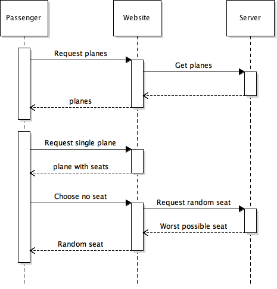

# Check-in design document

This application shall let users check into a plane from a client application.
   

## Data
Basic data structure

A plane has a number of passengers and seats. A seat has a passenger (and the other way around)

Constraints:

- No seat can have more than one passanger
- One passanger can only have one seat on a plane

## Database design

The database is gonna be made up of a list of planes and passangers. The planes also have a list of Seats.

## REST API Design

The REST Api should be able to serve the following endpoints:

- GET /planes - Return all planes
- GET /planes/{{planeId}} - Return plane with id
- POST /planes/{{planeId}}/passangers - Add passanger to plane
- GET /planes/{{planeId}}/seats - Get all Seats of a plane
- PUT /planes/{{planeId}}/seats/{{seatId}} - Modify seat on a plane. This route should also check for the following contraints if paying: 
    - Passanger not already on plane.
    - Seat not reserved to other passenger.
    - Passanger has enought balance to pay.
- GET /planes/{{planeId}}/seats/{{seatId}} - Get a single seat on a plane
- GET /planes/{{planeId}}/passangers - Get all passangers for plane
 

## Passenger check-in flow

At first the user is presented with a list of planes.
The passanger will then select a plane. After that he is presented with the seats on that plane. He can pick a seat, which will be reserved for him for 3 minutes. If the passenger pays before that timeline, the resevation will be removed. If this is the case, he hase to choose a new one. A passanger could alternatively choose to get a random seat.

Sequence diagram for choosing your own seat:

Sequence diagram for gettin a random seat:

## Summary
 
The application will be a client-server application. The AngularJS client will request plane information from a Restful Node.JS server. 

The database will be centered around the planes, which will have a number of seats and passangers.

A passanger can view all seats on a plane and then reserve one. This triggers a 3 minute reservation on the server. If the passanger pays in this timeframe, he will be assigned this seat. It is important to notice, that the constraints for the "Reserve Seat" (PUT /planes/{{planeId}}/seats/{{seatId}}) scenario under REST API Design.