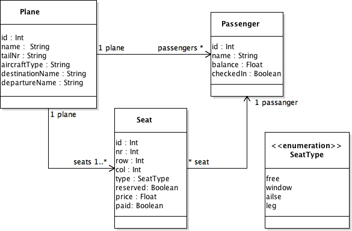

# Check-in design document

This application shall let users check into a plane from a client application.

The application will use the following arcitecture:

- Backend: Node.JS, mongodb 
- Client: AngularJS
   

## Data
Basic data structure

A plane has a number of passengers and seats. A seat has a passenger (and the other way around)

Constraints:

- No seat can have more than one passanger
- One passanger can only have one seat on a plane

## Database design

The database is gonna be made up of a list of planes and passangers. The planes also have a list of Seats.

## REST API Design

The REST Api should be able to serve the following endpoints:

- GET /planes - Return all planes
- GET /planes/{{planeId}} - Return plane with id
- POST /planes/{{planeId}}/passangers - Add passanger to plane
- GET /planes/{{planeId}}/seats - Get all Seats of a plane
- PUT /planes/{{planeId}}/seats/{{seatId}} - Modify seat on a plane. This route should also check for the following contraints: 
    - Passanger not already on plane.
    - Seat not reserved
    - Passanger has enought balance to pay
- GET /planes/{{planeId}}/seats/{{seatId}} - Get a single seat on a plane
- GET /planes/{{planeId}}/passangers - Get all passangers for plane
 

## 