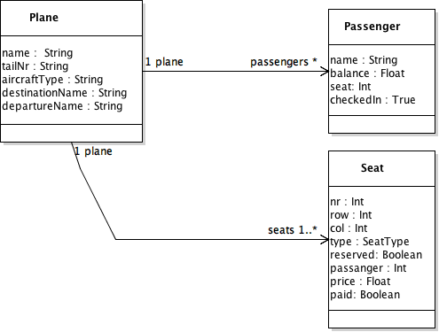

# Check-in 

This application shall let users check into a plane from a client application.

The application will use the following arcitecture:

- Backend: Node.JS, mongodb 
- Client: AngularJS
   

## Data
Basic data structure

A plane has a number of passengers and seats. A seat has a passenger (and the other way around)

Constraints:

- No seat can have more than one passanger
- One passanger can only have one seat on a plane

## Database design

The database is gonna be made up of a list of planes and passangers. The planes also have a list of Seats.

## REST API Design

